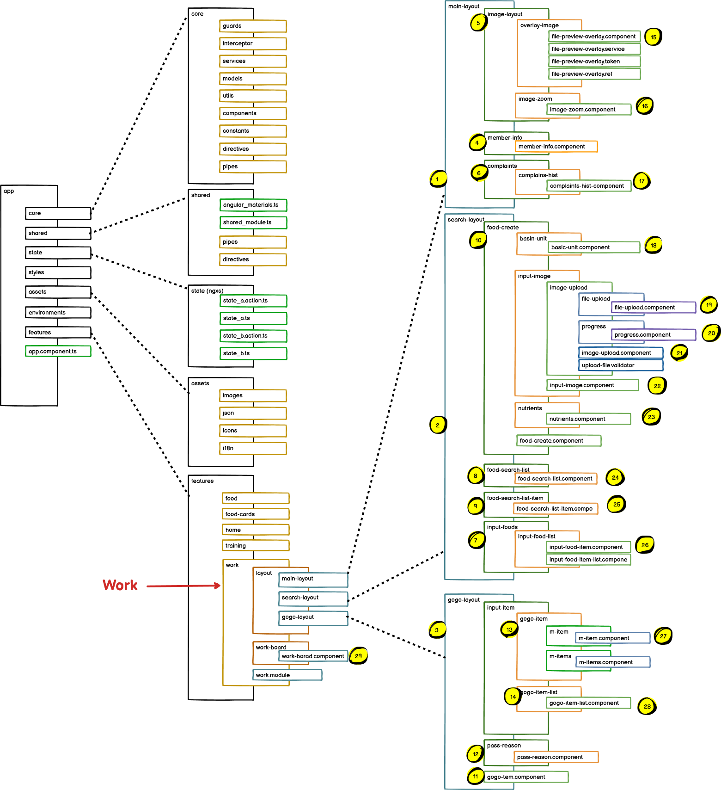
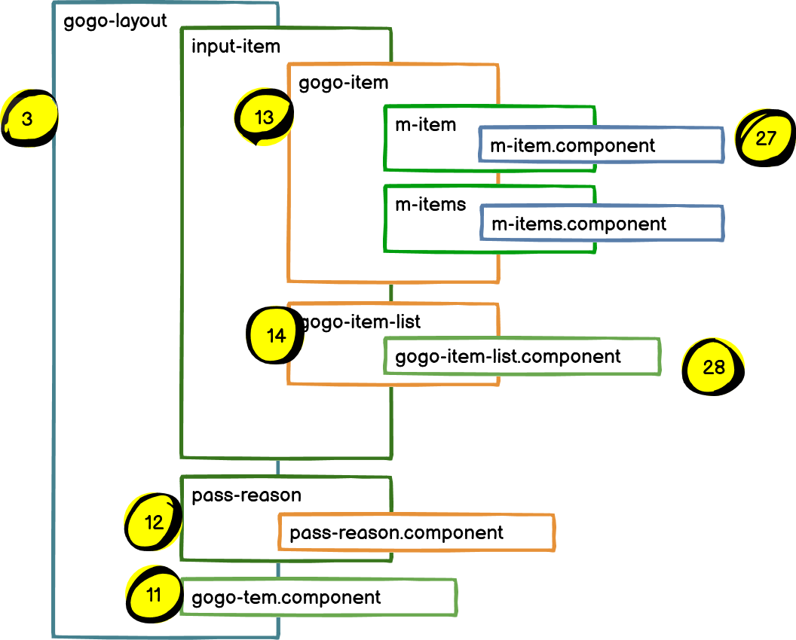

### Work
* 멤버의 정보를 표시함,
* 멤버가 입력한 음식정보를 표시함.
* 멤버가 입력한 음식의 이미지를 표시함.
* 새로운 음식에 대해서 생성하는 기능을 수해함.
* 멤버가 입력 음식정보에 대한 영양성분 및 칼로리등을 계산하여 멤버에게 전달하는 기능을 수행함.
* 멤버가 입력한 음식정보가 라이브러리에 있는 것이면 음식 검색을 자동으로 수행함.


### 그림1 Component relations diagram


그림2의 번호 1-14는 그림1의 1-14와 관련되어 있다.

### 그림2 Component and UI mapping diagram


그림1, 그림2는 
directory로 구분되어 있으며, directory의 마지작 가지에는 component 화일이 존재한다.

각 dirctory및 component에 대한 설명.
Work 화면은 크게 3개로 구분된다. 1, 2, 3
1. main-layout: 정보영역으로 member 정보, member가 보낸 음식 이미지, member가 보낸 음식에 대한 complaints를 표시한다.
2. search-layout: 음식을 검색하고, 검색결과를 리스트로 보여주고 검색된 음식을 선택하면 선택된 음식으로 gogo block에 등록한다. 그리고 음식을 새로 생성하기도 한다.
3. gogo-layout: 자동검색으로 만들어 졌거나, 음식검색 결과로 만들어진 음식의 정보를 가공하여 member에게 전달을 하는 기능을 수행한다.
4. Manager가 member가 임력한 음식에 대한 답변 정보 입력을 거절하는 기능을 수행한다.


### 그림3 work main-layout diagram

main-layout
```angular2html
4. member-info: food-card를 읽어와서 거기에 포함된 user id를 이용하여 member info을 읽어와 표시한다.
5. image-layout: food-card를 읽어와서 거기에 포하되 이미지를 표시한다.
6. complaints: food-card id를 이용하여 member의 complaints정보를 읽어와 표시한다.
15. file-preview-overlay.component: 이미지를 표시하는데, 이미지를 보면서 작업을 수행해야 하므로 이미지를 cdk library를 활용하여 ovelay방식으로 표시한다.
16. image-zoom.component: 15번이 수행할 수 있도록 image-zoom 기능을 호출하는 기능을 수행한다.
17. complaints-hist.component: member의 complaints를 읽어와서 card-type, food-type으로 구분하여 표시한다.

```


### 그림4 work search-layout diagram

search-layout
```
10. food-create: 음식 생성의 입력 항목이 많아서 하나의 프로그램이 너무 크게 되는 것을 방지(유지보수의 어려움) 하기 위하여
    프로그램을  basic-unit, input-image, nutrients 로 구분했다. ControlValueAccessor 기술 적용했다.
18. measure-quantity, serving-quantity, measure-unit, serving-unit 을 한개이상 입력하는 기능을 수행한다. 입력된 결과는
    food-create.component 에서 control value (formControlName 값들을 읽어옴) 로 취합된다.  
19. 음식 생성시 음식 이미지를 서버로 업로드 하는 기능을 수행한다.
20. 이미지가 업로드 될 때 progress bar로 업로드되는 상태를 표시한다.
21. 입려된 이미지를 upload 할 수 있도록 파일을 읽어오고 분리하는 작업을 수행한다.
23. 각 영양성분을 입력하는 화면을 제공하고, 입력된 영양소는 ControlValueAccessor 기술로 Parent food-create.component로 
    전달된다.
8. 24. 음식을 검색하여 검색한 결과를 리스트로 표시한다.
9. 25. 검색한 결과를 measureQuantity, servingQuantity, measureUnit, servingUnit 등으로 구분하여  하나의 list 항목 (item) 으로 만든다. 
7. member가 입력한 음식정보를 표시한다. 
26, 각 음식으 항목을 item 요소로 구분하고, 이 각각을 자동 검색의 요소로 적용한다. 그리고 이 각각의 요소를 리스트로 표현한다. 
```


### 그림5 work gogo-layout diagram


```angular2html
3. gogo-layout: 자동검색으로 만들어 졌거나, 음식검색 결과로 만들어진 음식의 정보를 가공하여 member에게 전달을 하거나, 
   Manager가 음식을 입력할 때 입력을 거절하는 기능을 수행한다.
13. 자동검색 혹은 수동검색 리스트에서 선택하여 고고를 진행하려고 모은 음식정보 들을 표시하는 항목이다. 
14. 모은 음식 정보를 리스트로 표시한다.
27. 음식정보의 칼로리, 지장, 단백질, 탄수화물로 구분하여 표시하고, servingUnit에 따라서 다르게 표현되는 값을 단위에 따라
    변견되는 servingQuantity를 조정하는 기능을 표현한다. 
28. 27.에서 가각의 요소로 표현된 값들을 리스트로 표현한다.
12. Manager가 gogo 아이템 입력을 거절하는 기능을 수행한다.
11. 13.14,12의 항목을 UI 배치하여 표시한다. 

```


